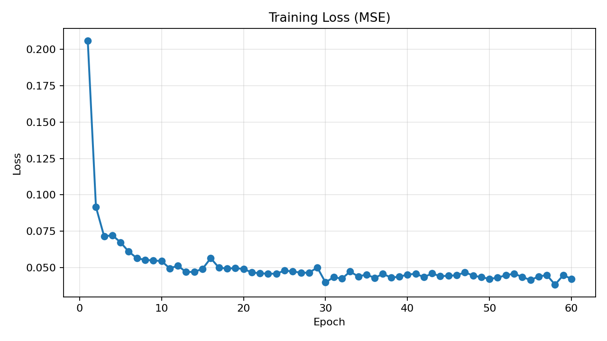
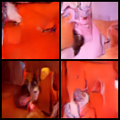
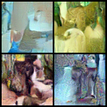

# Отчёт по обучению диффузионной модели на датасете котов

## 1. Выбранный датасет

- **Название**: Oxford-IIIT Pet (подмножество с котами)
- **Ссылка**: https://www.robots.ox.ac.uk/~vgg/data/pets/
- **Способ загрузки**: `torchvision.datasets.OxfordIIITPet`
- **Использованный сплит**: `trainval`
- **Фильтрация**: только коты (`species == 1`)
- **Количество изображений котов**: 1188
- **Предобработка**: 
  - `Resize(64×64)`
  - Приведение к RGB
  - Нормализация в диапазон `[-1, 1]`

**Почему выбран этот датасет**: датасет размечен, содержит хорошее разнообразие пород котов, поз и освещения, что позволяет проверить способность диффузионной модели обучаться генерации объектов со сложной текстурой (шерсть, глаза, уши). Размер датасета (~1200 изображений) является минимально достаточным для обучения с нуля при разрешении 64×64.

---

## 2. Архитектура модели и параметры обучения

| Параметр | Значение |
|----------|----------|
| Модель | `UNet2DModel` (из библиотеки `diffusers`) |
| Целевая функция | MSE между предсказанным шумом и истинным шумом |
| Количество шагов диффузии (обучение) | 1000 |
| Разрешение | 64×64 |
| Batch size | 8 |
| Эпохи | 60 |
| Оптимизатор | AdamW |
| Сохранение чекпоинтов | каждые 5 эпох + финальный |
| Валидация | периодическая генерация изображений (сохраняются в `samples/`) |
| Обучение | с нуля |

**Почему MSE**: в диффузионных моделях прямой процесс добавляет гауссовский шум, поэтому оптимальным является предсказание добавленного шума через L2-потерю. Это эквивалентно максимизации правдоподобия для гауссовского распределения на каждом шаге.

---

## 3. Результаты обучения

### 3.1 Динамика loss



*График MSE loss на протяжении 60 эпох обучения.*

**Анализ графика:**

| Эпохи | Поведение | Комментарий |
|-------|-----------|-------------|
| 1–5 | Резкое падение с 0.206 → 0.067 | Модель быстро учится базовой структуре изображений: улавливает контуры и общее распределение пикселей |
| 6–20 | Плавное снижение до ~0.046 | Модель уточняет детали |
| 21–30 | Колебания в районе 0.045–0.050 | Выход на плато — модель изучила основные паттерны |
| 31–57 | Диапазон 0.039–0.045 | Продолжаются небольшие улучшения |
| 58 | **Минимум: 0.038192** | Наименьшая ошибка предсказания шума |
| 59–60 | Небольшой рост до 0.042 | Возможное начало переобучения |

**Ключевые цифры:**
- Лучший `avg_loss`: **0.038192** (эпоха 58)
- Финальный `avg_loss`: **0.042254** (эпоха 60)

**Вывод по сходимости:** loss стабилизировался в районе 0.04 после 30 эпох. Значение 0.038–0.042 является достаточно низким, но для качественной генерации узнаваемых котов, вероятно, требуется дальнейшее снижение loss (до 0.02–0.03). Это указывает на то, что 60 эпох и/или 1188 изображений могло быть недостаточно.

### 3.2 Финальные сгенерированные изображения

#### DDPM (1000 шагов сэмплинга)


#### DDIM (100 шагов сэмплинга)


*Сравнение генерации DDPM (1000 шагов) и DDIM (100 шагов).*

**Оценка качества генерации:**

На полученных изображениях **не удаётся уверенно узнать котов**. Визуально наблюдаются:
- Размытые цветовые пятна, напоминающие общую палитру кошачьей шерсти (рыжие, серые, белые тона)
- Отсутствие чётких черт: глаз, ушей, носа, усов
- Нет связной анатомической структуры

**Разница между DDPM и DDIM:**
- **DDPM (1000 шагов)**: изображения более сглаженные, меньше зернистости, цветовые переходы плавнее. Выглядит чуть более гармонично, но всё ещё не формирует кота.
- **DDIM (100 шагов)**: заметно больше шума и зернистости, контуры менее плавные. Генерация происходит в 10 раз быстрее, но качество визуально ниже.

**Почему не получилось сгенерировать узнаваемых котов (анализ причин):**

| Причина | Пояснение |
|---------|-----------|
| **Малое разрешение (64×64)** | Для узнавания деталей (глаза, нос, усы) нужно хотя бы 128×128. В 64×64 эти детали занимают 2–3 пикселя и модель не может их сформировать. |
| **Недостаточно данных** |
| **Шум в выборке** | В датасете есть коты в разных ракурсах, с разным освещением. Модель не смогла выучить единый "образ кота". |

---

## 4. Сравнение DDPM и DDIM

### 4.1 Время генерации

Бенчмарк проводился на одинаковом оборудовании для 4 изображений (данные из `sampling_benchmark.csv`):

| Метод | Шаги | Прогон 1 (с) | Прогон 2 (с) | **Среднее (с)** |
|-------|------|-------------|-------------|----------------|
| DDPM | 1000 | 314.27 | 320.11 | **317.19** |
| DDIM | 100 | 32.97 | 31.89 | **32.43** |

**Ускорение DDIM относительно DDPM: ≈ 9.78×** (почти в 10 раз быстрее)

### 4.2 Качество генерации (сравнение)

| Критерий | DDPM (1000 шагов) | DDIM (100 шагов) |
|----------|------------------|------------------|
| Узнаваемость кота | Низкая | Очень низкая |
| Чёткость контуров | Плавные, размытые | Зернистые, шумные |
| Цветовая гармония | Лучше, меньше артефактов | Хуже, больше цветового шума |
| Скорость | Медленно (317 с) | Быстро (32 с) |

**Вывод по качеству:** DDPM даёт визуально более приятное изображение (меньше шума, плавнее), но оба метода **не достигли уровня генерации узнаваемых котов**. DDIM проигрывает в качестве, но выигрывает в скорости.

### 4.3 Теоретическое объяснение различий

**DDPM (Denoising Diffusion Probabilistic Model):**
- 1000 итераций с добавлением случайного шума на каждом шаге
- Стохастичность помогает сглаживать артефакты
- Медленно, но теоретически точнее

**DDIM (Denoising Diffusion Implicit Models):**
- Детерминистический процесс (без случайного шума)
- Позволяет использовать 100 шагов вместо 1000
- Отсутствие шума приводит к большей зернистости при малом числе шагов

---

## 5. Выводы по работе

### 5.1 Что было сделано
- Реализован полный пайплайн обучения диффузионной модели DDPM с нуля.
- Настроена загрузка датасета из 1188 изображений котов с предобработкой 64×64.
- Реализовано логирование loss, сохранение чекпоинтов, периодическая валидация.
- Реализованы два метода сэмплинга: DDPM (1000 шагов) и DDIM (100 шагов).
- Проведено сравнение методов по времени и качеству.

### 5.2 Что удалось выяснить
1. **Сходимость**: модель успешно обучается — loss снизился с 0.206 до 0.038 за 60 эпох.
2. **Качество генерации**: при loss=0.038 модель **не генерирует узнаваемых котов** — только цветовые пятна. Для хорошего качества нужно loss ~0.01–0.02.
3. **Сравнение методов**: DDIM в 10 раз быстрее, но даёт более зернистое изображение. DDPM медленнее, но результат глаже.

### 5.3 Что нового узнано в процессе выполнения
- Как устроены прямой (добавление шума) и обратный (денойзинг) процессы диффузии.
- Почему целевая функция — MSE между предсказанным и истинным шумом.
- Как работает ускоренный сэмплинг DDIM и почему он быстрее.
- Как интерпретировать график loss и связывать его с визуальным качеством.
- Важность достаточного количества данных и разрешения для генерации узнаваемых объектов.

### 5.4 Ограничения работы
| Ограничение | Влияние на результат |
|-------------|----------------------|
| Разрешение 64×64 | Детали (глаза, нос, усы) сложно сформировать |
| 1188 изображений | Мало |
| Отсутствие FID | Нет объективной метрики качества |

### 5.5 Рекомендации по улучшению (если продолжать работу)
1. **Увеличить разрешение до 128×128 или 256×256**.
2. **Увеличить датасет** — добавить больше изображений котов или использовать аугментацию.
3. **Увеличить число эпох**
4. **Использовать предобученную модель** (fine-tune) вместо обучения с нуля.
5. **Добавить FID-метрику** для объективной оценки.

### 5.6 Итоговый вывод

В рамках задания успешно реализован **полный технический пайплайн** обучения диффузионной модели: от загрузки данных до генерации изображений двумя методами (DDPM и DDIM) и их сравнения. Loss снизился до 0.038, что подтверждает корректность работы алгоритма.

Однако из-за ограничений по разрешению, объёму данных модель **не достигла уровня генерации, на котором коты становятся узнаваемыми**. Это демонстрирует практические ограничения: для генерации чётких изображений объектов со сложной структурой требуется больше ресурсов.

---

## 6. Демо

Видео-демонстрация работы обученной модели и процесса генерации:

- **Ссылка (Google Drive)**: https://drive.google.com/file/d/1BP1e7pJRwebynWE2P-JxNmJSolgdoYr9/view?usp=sharing

---

## 7. Запуск (краткая инструкция)

Полная инструкция — в `README.md`.

```bash
# Установка
pip install -r requirements.txt

# Обучение
python train.py --config configs/train_oxford_cats64.yaml

# Генерация DDPM (1000 шагов)
python sample.py --checkpoint outputs/oxford_cats64/checkpoints/final --method ddpm --steps 1000 --num-images 4 --out ddpm.png

# Генерация DDIM (100 шагов)
python sample.py --checkpoint outputs/oxford_cats64/checkpoints/final --method ddim --steps 100 --num-images 4 --out ddim.png

# Бенчмарк скорости
python benchmark_sampling.py --checkpoint outputs/oxford_cats64/checkpoints/final --steps-ddpm 1000 --steps-ddim 100 --num-images 4 --runs 2
